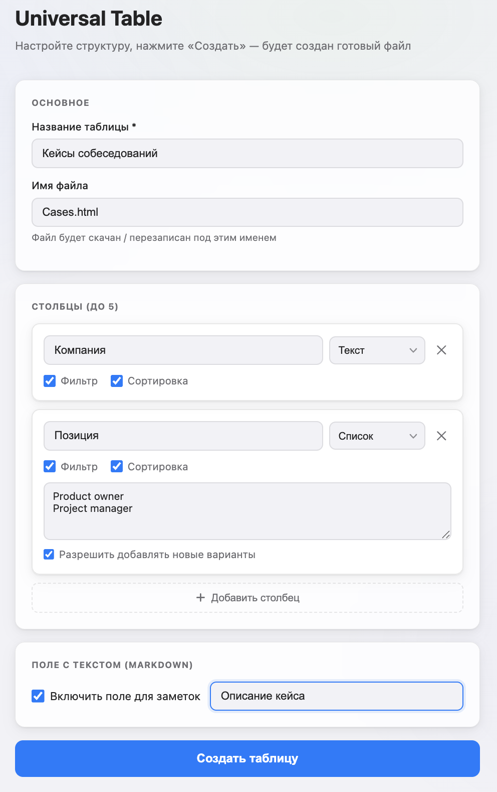
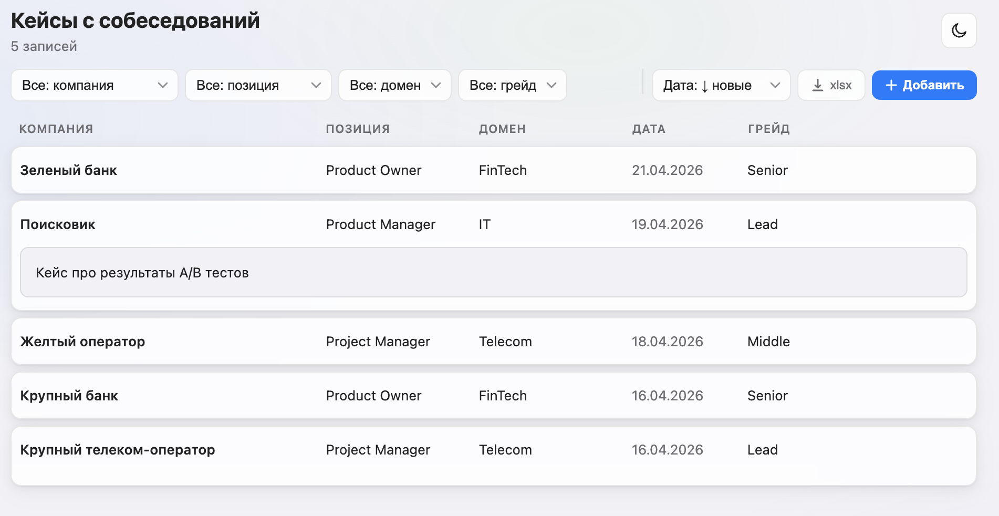

# Universal Table

Универсальный self-modifying HTML-шаблон для хранения, добавления, редактирования, отображения и экспорта любых табличных данных — без сервера и зависимостей.

---

## Как это работает

Вся логика и данные хранятся в одном HTML-файле. Никакого сервера, никакой базы данных, никаких зависимостей — просто файл в браузере.

1. Откройте `universal-table.html` в браузере
2. Настройте структуру таблицы: название, столбцы, типы данных
3. Нажмите **«Создать»** — скачается готовый файл
4. Работайте с данными: добавляйте, редактируйте, удаляйте, фильтруйте, сортируйте, экспортируйте в XLSX
5. Сохраните изменения обратно в файл одной кнопкой

| Настройка структуры | Работа с данными |
|---|---|
|  |  |

---

## Возможности

### Настройка структуры (Setup wizard)
- До 5 столбцов с типами: **текст**, **список (select)**, **дата**, **число**
- Для каждого столбца — включить/выключить фильтрацию и сортировку
- Для select-столбцов — список вариантов и опция «Другое...» (ввод произвольного значения)
- Опциональное Markdown-поле для развёрнутого описания каждой записи

### Работа с данными
- Фильтрация по любому настроенному столбцу
- Сортировка по тексту, дате, числу
- CRUD через модальную форму с валидацией
- Раскрытие записи для просмотра Markdown-поля
- Экспорт текущей выборки в **XLSX**
- Импорт данных из **XLSX** (roundtrip: экспорт → редактирование в Excel → импорт обратно)

### UX
- Адаптивный интерфейс: десктоп и мобайл
- Dark / light тема
- Индикатор несохранённых изменений + защита от случайного закрытия вкладки
- Сохранение файла: Chrome/Edge — перезапись на диске (File System Access API), Safari/Firefox — скачивание

